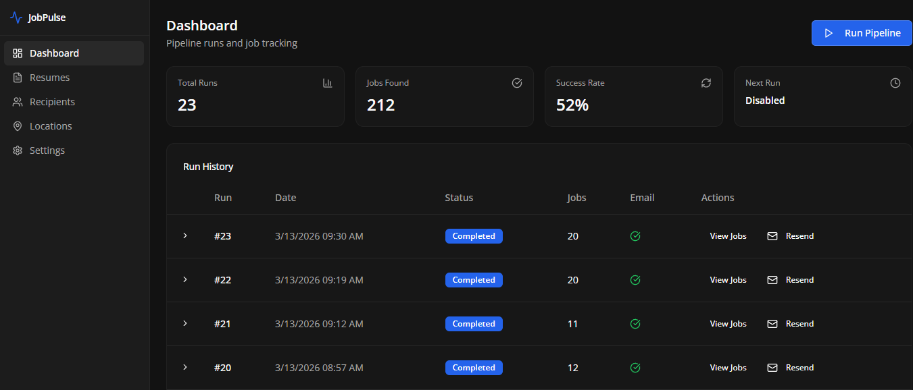
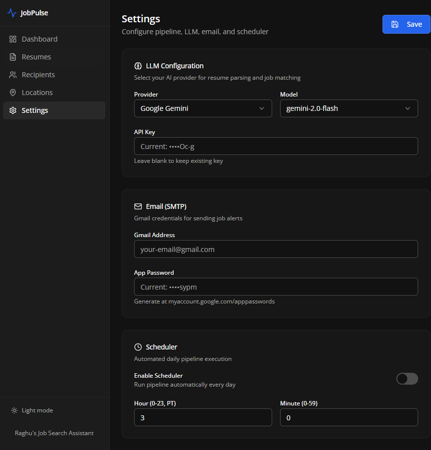
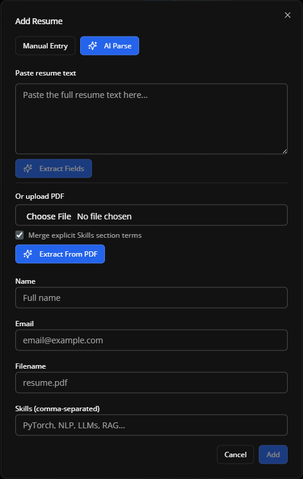

# JobPulse

[](https://github.com/RaghuHemadri/JobPulse.ai/releases/latest)
[](https://github.com/RaghuHemadri/JobPulse.ai/releases/latest/download/JobPulse-win.exe)
[](https://github.com/RaghuHemadri/JobPulse.ai/releases/latest/download/JobPulse-mac.dmg)

JobPulse is an open-source AI job copilot for ML/AI roles.

It pulls real LinkedIn jobs, ranks relevance against your resume, applies include/exclude/location/recency filters, and emails a daily top list.

## Why People Use JobPulse

- Real job links from LinkedIn only
- Resume-aware matching with LLM ranking
- Daily digest email with direct apply links
- Include/exclude keyword filters
- Persistent local state
- PDF resume parsing from the app UI

## Screenshots

### Dashboard Overview



### Settings and Filters



### Resume PDF Parsing



## Quick Start (Source)

### 1) Prerequisites

- Node.js 20+
- npm 10+

### 2) Install

```bash
npm install
```

### 3) Run in development

```bash
npm run dev
```

Open http://localhost:5000

### 4) Build and run production

```bash
npm run build
npm start
```

## Configuration

Set keys either in Settings UI or environment variables.

Supported environment variables:

- GEMINI_API_KEY
- GOOGLE_API_KEY
- OPENAI_API_KEY
- ANTHROPIC_API_KEY
- LLM_API_KEY

The app stores runtime config and job history in data/app-state.json.

## Privacy and Local Data

JobPulse keeps personal data local by default.

- Tracked template: data/app-state.example.json
- Local runtime file (gitignored): data/app-state.json
- Local generated folders (gitignored): data/trajectories, data/uploads

If you fork this repository, keep your real app-state.json out of commits.

## Desktop App (DMG and EXE)

This repository includes desktop packaging via Electron + electron-builder.

### Local packaging

```bash
npm run desktop:dist
```

Platform-specific packaging:

```bash
npm run desktop:dist:mac
npm run desktop:dist:win
```

Outputs are created in dist/ and release directories used by electron-builder.

## GitHub Releases for Direct Downloads

A release workflow is included to produce installers on GitHub Actions:

- macOS: .dmg
- Windows: .exe (NSIS)

Release page:

- https://github.com/RaghuHemadri/JobPulse.ai/releases

Direct latest download links:

- Windows (.exe): https://github.com/RaghuHemadri/JobPulse.ai/releases/latest/download/JobPulse-win.exe
- macOS (.dmg): https://github.com/RaghuHemadri/JobPulse.ai/releases/latest/download/JobPulse-mac.dmg

To publish:

1. Push a semver tag, for example v1.0.0
2. GitHub Actions builds installers
3. Artifacts are attached to the Release

Workflow file: .github/workflows/release-desktop.yml

## Open Source Friendly Defaults

- No personal resumes or emails are seeded in code
- Sensitive local files are gitignored
- Contributor docs and issue templates included

## Contributors Wanted

JobPulse is actively looking for open-source contributors.

If you want to help, pick an issue or propose a feature:

- Issues: https://github.com/RaghuHemadri/JobPulse.ai/issues
- New issue template: https://github.com/RaghuHemadri/JobPulse.ai/issues/new/choose
- Pull requests: https://github.com/RaghuHemadri/JobPulse.ai/pulls

High-impact feature areas:

- More job sources with anti-duplication and quality controls
- Better ranking explanations and confidence calibration
- Saved searches and multi-profile support
- More resume parsing improvements (DOCX and richer skill extraction)
- Alerting channels beyond email (Slack, Discord, webhook)
- End-to-end tests for pipeline, parsing, and desktop packaging

First-time contributors are welcome. Small improvements, docs fixes, and focused bugfix PRs are great ways to start.

## Contributing

See CONTRIBUTING.md for setup, coding standards, and PR guidelines.

## Security

See SECURITY.md for reporting vulnerabilities.

## Credits

- Perplexity Computer for creating the initial UI prototype.

## License

MIT License. See LICENSE.
